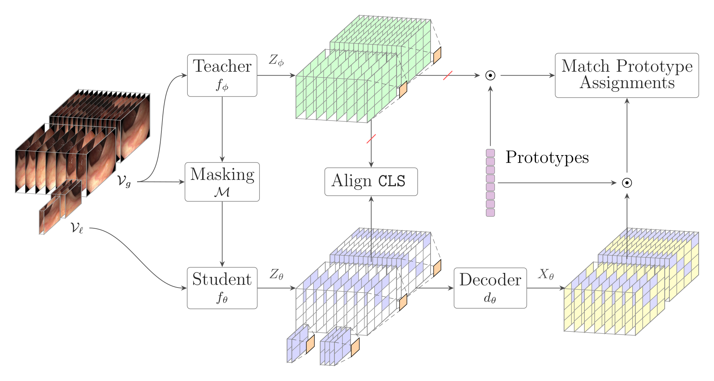
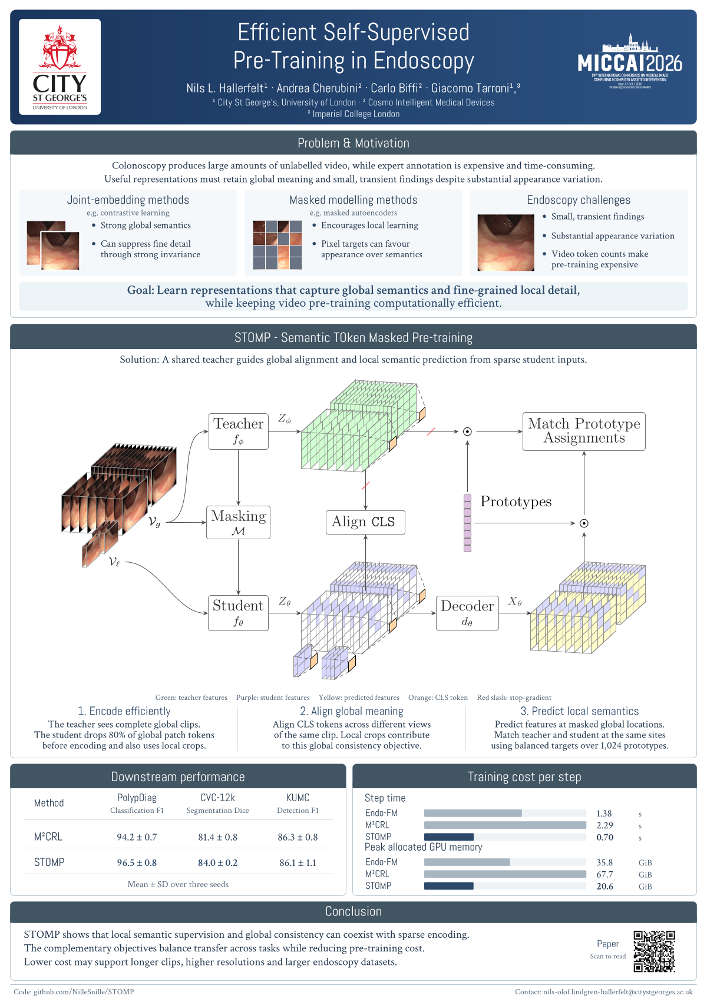

# STOMP: Efficient Self-Supervised Pre-Training in Endoscopy

Official implementation of **STOMP (Semantic Token-dropping Masked Pre-training)**, accepted at **MICCAI 2026 CaPTion**.

**Nils L. Hallerfelt, Andrea Cherubini, Carlo Biffi, and Giacomo Tarroni**

[Paper](https://papers.miccai.org/miccai-2026-sat/paper/CaPTion_006.pdf) · [Poster](docs/assets/stomp-poster.pdf) · [Method figure](docs/assets/stomp-method.pdf) · [Code](https://github.com/NilleSnille/STOMP) · [Citation](#citation)

STOMP learns endoscopy video representations using a shared momentum teacher, cross-view global alignment, and local semantic prediction. The student drops masked tokens before encoding; a lightweight decoder predicts their semantics through balanced prototype assignments.

## Method overview

[](docs/assets/stomp-method.pdf)

*STOMP combines global alignment across views with local semantic prediction. Green tokens are teacher features, purple tokens are student features, yellow tokens are decoder predictions, and orange tokens are global `[CLS]` representations. Red slashes indicate stopped gradients.*

1. **Encode efficiently.** The momentum teacher sees complete global clips. The student drops **80% of global patch tokens** before encoding.
2. **Align global meaning.** Match teacher and student `[CLS]` predictions across different views of the same clip, encouraging representations that are stable under changes in appearance and viewpoint.
3. **Predict local semantics.** A lightweight decoder predicts features at masked locations. Teacher features and decoder predictions are compared through a shared set of 1,024 prototypes and Sinkhorn-balanced assignments.

Both objectives use the same teacher. The local objective supplies spatial supervision in feature space, while token dropping reduces encoder computation.

## Results reported in the paper

Downstream scores.

| Method | PolypDiag classification F1 (%) | CVC-12k segmentation Dice (%) | KUMC detection F1 (%) |
| --- | ---: | ---: | ---: |
| Endo-FM | 90.7 ± 0.4 | 73.9 ± 1.2 | 84.1 ± 1.3 |
| M²CRL | 94.2 ± 0.7 | 81.4 ± 0.8 | **86.3 ± 0.8** |
| **STOMP** | **96.5 ± 0.8** | **84.0 ± 0.2** | 86.1 ± 1.1 |

STOMP improves classification and segmentation in this comparison, with comparable detection performance. Its training cost is lower in the matched per-step benchmark:

| Method | Time per step | Peak allocated GPU memory | FLOPs per step |
| --- | ---: | ---: | ---: |
| Endo-FM | 1.38 s | 35.8 GiB | 50.4 T |
| M²CRL | 2.29 s | 67.7 GiB | 91.4 T |
| **STOMP** | **0.70 s** | **20.6 GiB** | **30.1 T** |

*Paper Tables 1 and 4. Compute is measured for one optimization step with batch size 8, mixed-fp16 precision, and an NVIDIA A100-80G. See the [paper](https://papers.miccai.org/miccai-2026-sat/paper/CaPTion_006.pdf) for all comparisons and ablations.*

<details>
<summary>Conference poster</summary>

[](docs/assets/stomp-poster.pdf)

</details>

## Release scope

This release contains STOMP pretraining, its token-dropping video transformer and decoder, and PolypDiag classification fine-tuning and linear probing. The source package is `ssl_space`; the method is registered as `stomp`.

The paper also evaluates CVC-12k segmentation and KUMC detection. Those task-specific training pipelines, the original cross-validation splits, datasets, and trained STOMP checkpoints are not included in this release. The [Endo-FM repository](https://github.com/med-air/Endo-FM) describes the upstream datasets and downstream protocols; reproducing the full paper requires those additional components.

## Installation

Use Linux, Python 3.10 or newer, and a CUDA-capable GPU for training. The training drivers use `torchrun` and NCCL, including for one GPU.

```bash
git clone https://github.com/NilleSnille/STOMP.git
cd STOMP
python -m venv .venv
source .venv/bin/activate
python -m pip install --upgrade pip
```

Install a matching PyTorch/torchvision pair for your CUDA setup using the [official PyTorch instructions](https://pytorch.org/get-started/locally/), then install the project:

```bash
python -m pip install -e .
```

Dependencies are listed in [`requirements.txt`](requirements.txt). These compatibility ranges are not an archived environment from the paper experiments. Run commands below from the repository root because configuration files reference other files by relative path.

## Data

Obtain the datasets and follow their access terms and the [Endo-FM preprocessing protocol](https://github.com/med-air/Endo-FM#datasets). This repository does not download or redistribute video data.

### Pretraining

Place prepared clips under a data root, with a headerless `train.csv`:

```text
data/pretrain/
├── train.csv
└── dataset_name/
    ├── clip_0001.mp4
    └── clip_0002.mp4
```

Each manifest row is `folder,filename,label`, relative to the data root. Labels are unused in self-supervised pretraining:

```text
dataset_name,clip_0001.mp4,-1
dataset_name,clip_0002.mp4,-1
```

To generate a manifest for already prepared MP4 clips:

```bash
python dataset-curation/endo-fm-data/gencsv.py data/pretrain
```

This utility inventories clips; it does not reproduce the paper's dataset selection or preprocessing. Keep directory and file names free of commas. The default root is `data/pretrain`; set `STOMP_PRETRAIN_DATA` to use another location.

### PolypDiag

The classification loader expects prepared videos and the corresponding original split lists:

```text
data/downstream/polypdiag/
├── videos/
│   └── clip_0001.mp4
└── splits/
    ├── train.txt
    ├── val.txt
    └── test.txt
```

Each split file is headerless, with `relative_video_path,label` on each line. Video paths are relative to `videos/`, and labels are binary integers (`0` or `1`) using the dataset's original mapping. The supplied downstream configs use `train.txt` and `test.txt`; `val.txt` is only needed if you select the validation config. Set `STOMP_POLYPDIAG_DATA` to override the default data root. Do not regenerate evaluation splits from individual frames.

## Pretraining

The supplied configuration initializes the encoder from the Kinetics-400 self-supervised ViT-B weights used by the upstream protocol. Obtain `kinetics400_vitb_ssl.pth` from the [SVT release](https://github.com/kahnchana/svt/releases/tag/v1.0), as linked by Endo-FM, and place it at:

```text
pretrained_weights/kinetics400/kinetics400_vitb_ssl.pth
```

Alternatively, set `STOMP_KINETICS_CHECKPOINT` to its path. This is an initialization checkpoint, not a trained STOMP checkpoint.

```bash
torchrun --standalone --nproc_per_node=1 \
  -m drivers.pretrain.main_pretrain \
  --fname configs/methods/stomp/main.yaml
```

Increase `--nproc_per_node` to the number of local GPUs. `optimizer.batch_size` is per process; the configured value is 12. Adjust it to available memory. The paper's compute comparison uses batch size 8. The configured learning rate is scaled by the global batch size.

The main settings are ViT-B, 30 epochs, 80% masking, 1,024 prototypes, and a four-block divided-attention decoder with dimension 384 and six heads. The configuration uses a Sinkhorn temperature of **0.10** and **soft assignments**.

## PolypDiag evaluation

Point `STOMP_PRETRAIN_DIR` to a completed pretraining run, replacing `YOUR_RUN_ID` with its actual run identifier:

```bash
export STOMP_PRETRAIN_DIR="exps/stomp/stomp_YOUR_RUN_ID"
torchrun --standalone --nproc_per_node=1 \
  -m drivers.downstream.polypdiag.main_eval_polypdiag \
  --fname configs/methods_eval/polypdiag/stomp/finetune.yaml
```

The config loads `${STOMP_PRETRAIN_DIR}/models/model_final_ep30.pth`. Edit `backbone.pretrained_kwargs.path` if using another checkpoint. The loader prefers the momentum teacher weights when present.

For a frozen backbone, use `configs/methods_eval/polypdiag/stomp/lp.yaml` instead. The driver runs seeds 0, 1, and 2, trains for 20 epochs per seed, and evaluates on the configured test split. It reports clip-level metrics across ten temporal clips per video; it does not aggregate predictions to one label per video. Summary metrics are written under `${STOMP_PRETRAIN_DIR}/polypdiag/{finetuned|frozen}/<run_id>/logs/test_result.csv`. Use one GPU for this documented evaluation command.

## Code map

| Component | Location |
| --- | --- |
| STOMP objectives and teacher/student logic | [`ssl_space/methods/stomp.py`](ssl_space/methods/stomp.py) |
| Shared training components | [`ssl_space/methods/base.py`](ssl_space/methods/base.py) |
| Token-dropping encoder | [`ssl_space/backbones/transformer/masked_vits.py`](ssl_space/backbones/transformer/masked_vits.py) |
| Attention blocks | [`ssl_space/backbones/transformer/vit_blocks.py`](ssl_space/backbones/transformer/vit_blocks.py) |
| Semantic decoder | [`ssl_space/backbones/transformer/decoders.py`](ssl_space/backbones/transformer/decoders.py) |
| Pretraining configuration | [`configs/methods/stomp/main.yaml`](configs/methods/stomp/main.yaml) |
| Video decoding and augmentation | [`ssl_space/datasets`](ssl_space/datasets), [`ssl_space/transforms`](ssl_space/transforms) |

## Checks

Small CPU regression tests cover the retained method and data pipeline without the research datasets:

```bash
python -m pip install -e '.[dev]'
python -m pytest -q
```

These checks do not reproduce the reported metrics or validate full-scale CUDA training.

## Citation

```bibtex
@inproceedings{hallerfelt2026stomp,
  title     = {Efficient Self-Supervised Pre-Training in Endoscopy},
  author    = {Hallerfelt, Nils L. and Cherubini, Andrea and Biffi, Carlo and Tarroni, Giacomo},
  booktitle = {Medical Image Computing and Computer Assisted Intervention (MICCAI)},
  year      = {2026},
  url       = {https://papers.miccai.org/miccai-2026-sat/paper/CaPTion_006.pdf}
}
```
